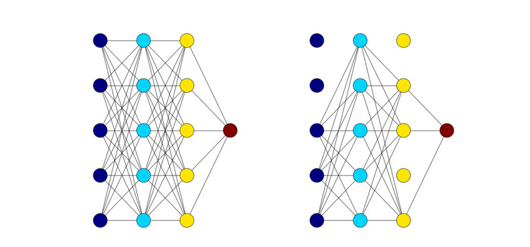

# 环境配置

**1.创建TensorFlow依赖环境**

    conda create -n tensorflow python=3.5.2

**2.下载安装依赖软件，使用清华大学镜像仓库，进行安装**

	pip install -i https://pypi.tuna.tsinghua.edu.cn/simple/ https://mirrors.tuna.tsinghua.edu.cn/tensorflow/windows/cpu/tensorflow-1.1.0-cp35-cp35m-win_amd64.whl

**3.安装成功后，安装 numpy/matplotlib/tqdm和jupyter库**

	conda install tqdm
	conda install numpy
	conda install matplotlib
	conda intall jupyter
# 项目优势
**解决梯度消失问题**
  -神经网络在循环训练的过程中，早期的数据会被更新的并不重要的输入与信息完全淹没，此故障成为梯度消失问题。本项目使用不同类型的循环网络层：长短期记忆层，即LSTM。
   ###**LSTM原理**

  在LSTM中，代替计算当前存储器时每次都使用相同方式的输入（xt)，神经网络可以通过“输入门”(it)决定当前值对储存器的影响程度，并做出一个决定；通过被命名为“忘记门”(ft)的遗忘的存储器(ct)做出另外一个决定，根据储存器将哪些部分通过“输出门”(ot)发送到下一个时间步长(ht)做第三个决定。

这三个门的组合创造了一个选择：一个单一的LSTM节点，可以将信息保存在长期储存器中，也可以将信息保存在短期储存器中，但不能同时进行。短期记忆LSTMs训练的是相对开放的输入门，让大量的信息进来，也经常忘记很多；而长期记忆LSTMs有紧密的输入门，只允许非常小的，非常具体的信息进入。这种紧密性意味着它不会轻易失去它的信息，并且允许保存更长的时间。
***避免同对象判断错误问题***
  -假设我们只是简单使用LSTM层，那么神经网络会读到无用的词。例如，一个句子使用“an animal”，另一个句子使用“the animal”。即他们所指对象相同，此时神经网络可能认为它已经找到negative entailment，导致判断出错。解决方法：项目通过一个叫“dropout”的过程实现dropout是神经网络设计中的一种正则化模式，它围绕着随机选择的隐藏和可见的单位。随着神经网络大小的增加，用来计算最终结果的参数个数也随着增加，如果一次训练全部，每个参数都会过度拟合。为了规范这一点，在训练中随机抽取神经网络中包含的部分，并在训练时临时调零，在实际使用过程中，它们的输出被适当地缩放。

“标准”（即完全连接）层上的dropout也是有用的，因为它有效地训练了多个较小的神经网络，然后在测试时间内组合它们。机器学习中的一个常数使自己比单个模型更好的方法就是组合多个模型，并且 dropout 用于将单个神经网络转换为共享一些节点的多个较小的神经网络。

一个dropout 层有一个称为p的超参数，它仅仅是每个单元被保存在神经网络模型中进行迭代训练的概率。被保存的单位将其输出提供给下一层，而不被保存的单位则没有提供任何东西。下面是一个例子，展示了一个没有dropout的完全连接的神经网络和一个在迭代训练过程中dropout的完全连接的神经网络之间的区别:

对于我们的LSTM层，我们将跳过内部的门的使用。这是Tensorflow的 DropoutWrapper对于循环层的默认实现。
1
	lstm_drop =  tf.contrib.rnn.DropoutWrapper(lstm, input_p, output_p)
由于不能有效地使用在LSTM中传递的信息，所以项目将使用单词和最终输出的功能上的dropout，而不是在展开的LSTM神经网络部分的第一层和最后一层有效地使用dropout。

**代码优化**

  定义神经网络所需要的常数，通过增加迭代次数，将迭代次数扩大为原来的十倍，可使准确性由50%-55%，增加至85%-90%，实现了模型优化。

	#Constants setup
max_hypothesis_length, max_evidence_length = 30,30
batch_size, vector_size, hidden_size = 128, 50, 64

lstm_size = hidden_size

weight_decay = 0.0001

learning_rate = 1

input_p, output_p = 0.5, 0.5

training_iterations_count = 1000000

display_step = 10

**其他优化建议**
  -对文本进行分词，通过词频给单词赋权。同时剔除不含任何意义的单词如：be动词、人称代词等等，减少无关词的训练时间。
  -通过增加数据集的大小，使神经网络得到更加充分的训练。
  -增加神经网络的层数，提高训练的复杂度。

